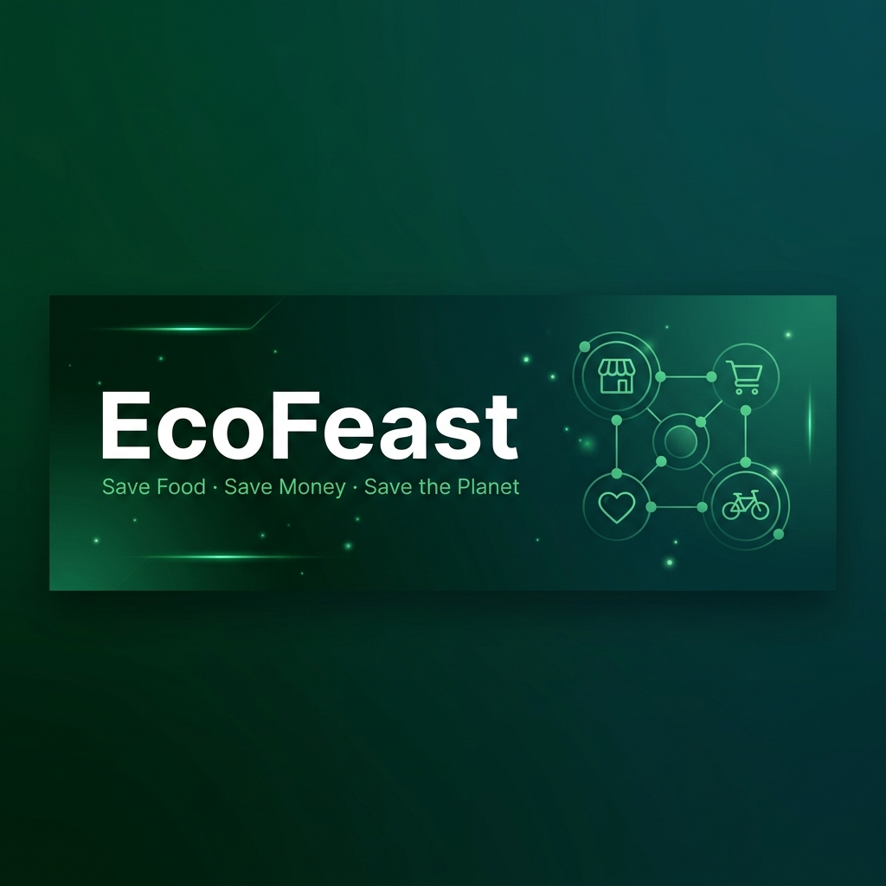
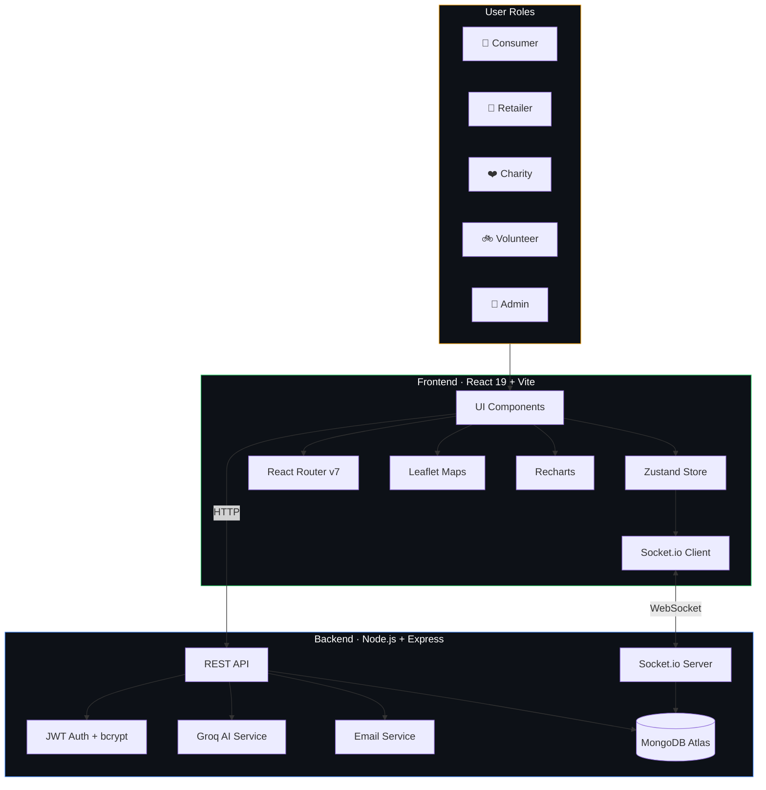

<div align="center">

  

  <br />
  <br />

  <p>
    <strong>An intelligent, full-stack logistics platform that combines real-time order synchronization with AI-driven insights to seamlessly connect retailers, consumers, charities, and volunteers — turning potential food waste into community impact.</strong>
  </p>

  <br />

  <!-- Tech Stack Badges -->
  
  
  
  
  
  
  
  
  

  <br />
  <br />

  <!-- Status Badges -->
  
  
  
  

  <br />
  <br />

  <a href="https://myecofeast.vercel.app">
    
  </a>

  <br />
  <br />

  <p>
    <a href="#-features">Features</a> ·
    <a href="#-architecture">Architecture</a> ·
    <a href="#-ai-pipeline">AI Pipeline</a> ·
    <a href="#-tech-stack">Tech Stack</a> ·
    <a href="#-quick-start">Quick Start</a> ·
    <a href="#-api-reference">API Reference</a>
  </p>
</div>

<br />

---

## 🎯 The Problem

Every year, **1.3 billion tonnes** of food is wasted globally while **828 million people** go hungry. The disconnect isn't about supply — it's about logistics. Surplus food exists at stores, but it never reaches the people who need it.

**EcoFeast bridges that gap** with a real-time, AI-powered logistics ecosystem that makes food rescue seamless for everyone involved.

---

## 🌟 Features

### 🏢 Retailer Dashboard
> *Zero-waste efficiency tools for store owners*

- **Surplus Listing Engine** — Create, edit, and manage food listings with category filters (Bakery, Meals, Produce, Grocery, Compost)
- **AI-Powered Listing** — Auto-predicts expiry windows, generates marketing tags, and calculates CO₂ impact per item
- **Image Upload** — Attach product photos for marketplace visibility
- **Order Pipeline** — Track incoming orders through `Received → Packed → Ready` workflow
- **Pickup Management** — Monitor volunteer task assignments and delivery status
- **Credit Points** — Earn reward credits for every charity donation
- **Real-Time Alerts** — Instant Socket.io notifications for new orders

---

### 🛒 Consumer Marketplace
> *Sustainable savings hub for everyday shoppers*

- **Surplus Browse** — Discover discounted food from local stores with category filtering
- **Dynamic Pricing** — See original vs. discount prices, up to **70% off**
- **Smart Cart** — Multi-store cart with quantity management and stock limits
- **Order Tracking** — Real-time status updates from placement to delivery
- **Live Delivery Map** — Watch your volunteer's location on an interactive Leaflet map
- **Eco-Points** — Earn reward points for every sustainable purchase

---

### ❤️ Charity Network
> *Streamlined donation claiming for verified organizations*

- **Bulk Claiming** — One-click access to free donation-tagged inventory
- **Auto-Assignment** — Deliveries automatically routed to nearby volunteers
- **Task Monitoring** — Track pickup and delivery status in real time

---

### 🚲 Volunteer Logistics
> *Real-time task management for last-mile delivery heroes*

- **Task Feed** — Browse and accept available pickup assignments with distance/ETA
- **Full Delivery Workflow** — `Accept → Pick Up → Deliver` with guided status progression
- **OTP Verification** — Secure, code-based delivery handoff confirmation
- **Live GPS Tracking** — Broadcast location to consumers and stores via Socket.io
- **Distance & ETA** — Haversine-calculated routing with time estimates
- **Vehicle Tracking** — Support for bicycle, motorcycle, car, and more

---

### ⚡ Real-Time Sync Engine
> *Powered by Socket.io — zero refresh, zero delay*

Every action propagates instantly across the entire platform:

```
Retailer packs order  →  Consumer sees "Packed" status
Volunteer picks up    →  Store sees "Picked Up" update
Volunteer moves       →  Customer tracks on live map
New item listed       →  All users get marketplace toast
```

- Bidirectional WebSocket events across all 5 user roles
- Animated toast notifications with progress bars and spring animations
- Persistent notification center (Zustand + localStorage) with read/unread filtering

---

## 🤖 AI Pipeline

<div align="center">
  <table>
    <tr>
      <td align="center" width="25%">
        <h4>⏳ Smart Expiry</h4>
        <p>Predicts optimal consumption windows based on food type and category</p>
      </td>
      <td align="center" width="25%">
        <h4>🏷️ Auto-Tagging</h4>
        <p>Generates marketing tags like "Fresh", "Rescued", "Organic" for listings</p>
      </td>
      <td align="center" width="25%">
        <h4>🌍 CO₂ Scoring</h4>
        <p>Calculates real-time carbon impact prevented per food rescue</p>
      </td>
      <td align="center" width="25%">
        <h4>🍳 Recipe Engine</h4>
        <p>Context-aware recipe suggestions from rescued ingredients</p>
      </td>
    </tr>
  </table>
</div>

> Powered by **Groq SDK** with **Llama 3.3** for high-speed LLM inference

---

## 🏗 Architecture



---

## 🛠 Tech Stack

<table>
  <thead>
    <tr>
      <th>Layer</th>
      <th>Technology</th>
      <th>Purpose</th>
    </tr>
  </thead>
  <tbody>
    <tr><td><strong>Framework</strong></td><td>React 19 + TypeScript</td><td>Component-based UI with type safety</td></tr>
    <tr><td><strong>Build</strong></td><td>Vite 6</td><td>Lightning-fast HMR and bundling</td></tr>
    <tr><td><strong>Styling</strong></td><td>Tailwind CSS</td><td>Utility-first responsive design</td></tr>
    <tr><td><strong>Animation</strong></td><td>Framer Motion</td><td>Spring physics, parallax, page transitions</td></tr>
    <tr><td><strong>State</strong></td><td>Zustand</td><td>Lightweight persistent state management</td></tr>
    <tr><td><strong>Maps</strong></td><td>Leaflet + React-Leaflet</td><td>Interactive delivery tracking maps</td></tr>
    <tr><td><strong>Charts</strong></td><td>Recharts</td><td>Analytics and data visualization</td></tr>
    <tr><td><strong>Icons</strong></td><td>Lucide React</td><td>Consistent, tree-shakeable icon library</td></tr>
    <tr><td><strong>Server</strong></td><td>Node.js + Express</td><td>RESTful API server</td></tr>
    <tr><td><strong>Database</strong></td><td>MongoDB Atlas + Mongoose</td><td>Document-based data persistence</td></tr>
    <tr><td><strong>Auth</strong></td><td>JWT + bcryptjs</td><td>Stateless authentication with hashed passwords</td></tr>
    <tr><td><strong>Real-Time</strong></td><td>Socket.io</td><td>Bidirectional event synchronization</td></tr>
    <tr><td><strong>AI</strong></td><td>Groq SDK (Llama 3.3)</td><td>Expiry prediction, tagging, recipe generation</td></tr>
    <tr><td><strong>Email</strong></td><td>Nodemailer + Brevo/SendGrid</td><td>OTP verification emails</td></tr>
    <tr><td><strong>Deployment</strong></td><td>Vercel</td><td>Edge-optimized frontend hosting</td></tr>
  </tbody>
</table>

---

## 🚀 Quick Start

### Prerequisites

```
Node.js    v18+
MongoDB    Atlas account (free tier works)
Groq       API key (free at console.groq.com)
```

### 1️⃣ Clone & Install

```bash
git clone https://github.com/Anubhav-Akhil/EcoFeast-v1.git
cd EcoFeast-v1
npm install
cd backend && npm install && cd ..
```

### 2️⃣ Configure Environment

Create `backend/.env`:

```env
PORT=8787
MONGODB_URI=your_mongodb_connection_string
JWT_SECRET=your_jwt_secret_key
GROQ_API_KEY=your_groq_api_key
FRONTEND_ORIGIN=http://localhost:5173

# Email (optional — pick one)
BREVO_API_KEY=your_brevo_key
# SENDGRID_API_KEY=your_sendgrid_key
# RESEND_API_KEY=your_resend_key
SMTP_EMAIL=your_email@gmail.com
SMTP_PASSWORD=your_app_password
```

### 3️⃣ Launch

```bash
# Start both frontend & backend concurrently
npm run dev:full
```

| Service  | URL                     |
| -------- | ----------------------- |
| Frontend | `http://localhost:5173` |
| Backend  | `http://localhost:8787` |

---

## 📡 API Reference

### Authentication

| Method | Endpoint              | Description                          |
| :----- | :-------------------- | :----------------------------------- |
| `POST` | `/api/auth/signup`    | Register a new user with role        |
| `POST` | `/api/auth/login`     | Authenticate and receive JWT token   |
| `POST` | `/api/auth/send-otp`  | Send OTP verification email          |
| `POST` | `/api/auth/verify-otp`| Verify email with OTP code           |

### Marketplace & Items

| Method   | Endpoint            | Description                              |
| :------- | :------------------ | :--------------------------------------- |
| `GET`    | `/api/items`        | Fetch available surplus inventory        |
| `POST`   | `/api/items`        | Create a new surplus listing             |
| `PATCH`  | `/api/items/:id`    | Update listing details or status         |
| `DELETE` | `/api/items/:id`    | Remove a listing                         |

### Orders & Fulfillment

| Method  | Endpoint                       | Description                                      |
| :------ | :----------------------------- | :----------------------------------------------- |
| `POST`  | `/api/orders`                  | Place an order (supports multi-store cart)        |
| `GET`   | `/api/orders`                  | Fetch orders for authenticated user               |
| `PATCH` | `/api/tasks/:id`               | Update volunteer task status                     |
| `POST`  | `/api/orders/:id/cancel-store` | Cancel a specific store's items in an order       |

### AI Services

| Method | Endpoint                 | Description                                  |
| :----- | :----------------------- | :------------------------------------------- |
| `POST` | `/api/ai/predict-expiry` | Get AI-predicted expiry, tags, and CO₂ score |
| `POST` | `/api/ai/suggest-recipe` | Get recipe suggestions from ingredient list  |

### WebSocket Events

| Event                       | Direction       | Description                              |
| :-------------------------- | :-------------- | :--------------------------------------- |
| `new-item`                  | Server → Client | Broadcast when new surplus is listed     |
| `order-updated`             | Server → Client | Order status change notification         |
| `new-order`                 | Server → Client | Alert retailer of incoming order         |
| `task-updated`              | Server → Client | Volunteer task status change             |
| `volunteer-location-update` | Client → Server | Volunteer GPS coordinate broadcast       |
| `volunteer-location-updated`| Server → Client | Relay volunteer position to consumers    |

---

## 📁 Project Structure

```
ecofeast/
├── public/                     # Static assets & banner
├── components/
│   ├── Layout.tsx              # App shell, nav, auth modal, notifications
│   ├── AddressMapModal.tsx     # Interactive map-based address picker
│   ├── DeliveryTrackingMap.tsx  # Live delivery tracking with markers
│   ├── AlertPopup.tsx          # Reusable alert dialog
│   ├── ConfirmPopup.tsx        # Confirmation dialog
│   ├── SuccessPopup.tsx        # Success notification
│   └── ui.tsx                  # Shared UI primitives (ModalShell, inputs, buttons)
├── pages/
│   ├── Home.tsx                # Animated landing with parallax hero
│   ├── Marketplace.tsx         # Consumer surplus browsing & cart
│   ├── Dashboards.tsx          # Role-specific dashboards (Retailer/Consumer/Charity/Volunteer)
│   ├── Profile.tsx             # User profile management & password change
│   ├── Impact.tsx              # Sustainability metrics
│   ├── HowItWorks.tsx          # Platform workflow guide
│   ├── Partners.tsx            # Retailer onboarding page
│   ├── Charities.tsx           # Charity onboarding page
│   ├── Volunteer.tsx           # Volunteer onboarding page
│   ├── About.tsx               # About page
│   └── Contact.tsx             # Contact form
├── services/
│   ├── api.ts                  # HTTP client with JWT management
│   ├── socket.ts               # Socket.io client instance
│   ├── aiService.ts            # AI endpoint wrappers
│   ├── notificationStore.ts    # Zustand notification state
│   └── mockBackend.ts          # Development mock data
├── backend/
│   ├── server.js               # Express server (1700+ lines, all routes)
│   ├── db.js                   # MongoDB connection
│   ├── models/                 # Mongoose schemas
│   │   ├── User.js
│   │   ├── Item.js
│   │   ├── Order.js
│   │   ├── Task.js
│   │   ├── Charity.js
│   │   ├── OTP.js
│   │   ├── Counter.js
│   │   └── ContactMessage.js
│   └── seed.js                 # Database seeding script
├── App.tsx                     # Root component with routing & cart logic
├── types.ts                    # Shared TypeScript interfaces
├── index.css                   # Global styles
└── vite.config.ts              # Vite configuration
```

---

## 🗺️ Roadmap

- [ ] Payment gateway integration (Razorpay/Stripe)
- [ ] Push notifications (FCM)
- [ ] Native mobile app (React Native)
- [ ] Admin analytics dashboard with advanced reporting
- [ ] Multi-language support (i18n)
- [ ] Store rating & review system

---

## 🤝 Contributing

Contributions are welcome! Please feel free to submit a Pull Request.

1. Fork the repository
2. Create your feature branch (`git checkout -b feature/amazing-feature`)
3. Commit your changes (`git commit -m 'Add amazing feature'`)
4. Push to the branch (`git push origin feature/amazing-feature`)
5. Open a Pull Request

---

## 📄 License

This project is licensed under the **MIT License** — see the [LICENSE](LICENSE) file for details.

---

<div align="center">
  <br />
  <p>Made with 💚 by <a href="https://github.com/Anubhav-Akhil">Anubhav</a> for a Greener Planet.</p>
  <p>
    <a href="https://myecofeast.vercel.app">Live Demo</a> ·
    <a href="https://github.com/Anubhav-Akhil/EcoFeast-v1/issues">Report Bug</a> ·
    <a href="https://github.com/Anubhav-Akhil/EcoFeast-v1/pulls">Request Feature</a>
  </p>
  <br />
  <sub>If EcoFeast helped or inspired you, consider giving it a ⭐</sub>
</div>
