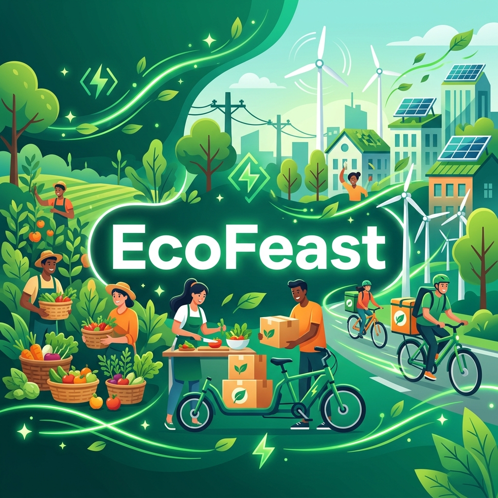

<div align="center">
  

  <br />

  <!-- Tech Stack Badges -->
  
  
  
  
  
  
  
  

  <br />
  <br />

  <!-- Status Badges -->
  
  
  
  

  <br />
  <br />

  <h3><strong>
    An intelligent, full-stack logistics platform that combines real-time order synchronization with AI-driven insights to seamlessly connect retailers, consumers, charities, and volunteers, turning potential food waste into community impact.
  </strong></h3>

  <br />

  <a href="https://ecofeast-v1.vercel.app">
    
  </a>

  <br />
  <br />

  <p>
    <a href="#-features">Features</a> ·
    <a href="#-architecture">Architecture</a> ·
    <a href="#-tech-stack">Tech Stack</a> ·
    <a href="#-quick-start">Quick Start</a> ·
    <a href="#-ai-pipeline">AI Pipeline</a>
  </p>
</div>

<br />

---

## 🌟 Features

**EcoFeast** is a mission-driven ecosystem built to bridge the gap between surplus food and those who need it most.

- **🏢 Retailer Dashboard:** Zero-waste efficiency tools including surplus listing, real-time inventory management, and dynamic discount pricing.
- **🛒 Consumer Marketplace:** Sustainable savings hub where users can browse discounted surplus food, track eco-points, and monitor live delivery tracking.
- **❤️ Charity Network:** Dedicated portals for verified organizations to claim bulk donations and automatically assign delivery tasks to local volunteers.
- **🚲 Volunteer Logistics:** Real-time task management system with live status tracking, OTP delivery verification, and interactive pickup assignments.
- **⚡ Unified Real-Time Sync:** Powered by Socket.io, every action (order placement, task assignment, pickup confirmation) is instantly synchronized across all user dashboards without refreshing.

---

## 🤖 AI Pipeline

*Integrated with the Groq API (Llama 3.3)*

Our platform leverages **AI-driven intelligence** to optimize the food rescue process:

- **⌛ Smart Expiry Prediction:** Analyzes food data to predict optimal consumption windows and automatically generate marketing tags.
- **📈 Sustainability Analytics:** Calculates the real-time CO2 impact prevented by rescuing food.
- **🍳 Creative Recipe Engine:** Provides instant, context-aware recipe suggestions based on rescued ingredients to minimize kitchen waste.
- **🎨 AI Media Generation:** Automates product image generation for retailers to speed up the listing creation process.

---

## 🛠 Tech Stack

### Frontend Architecture
- **Framework:** `React 18` + `Vite` + `TypeScript`
- **Styling:** `Tailwind CSS` for utility-first responsive design
- **State Management:** Custom React Hooks + Context API
- **Icons & UI:** `Lucide React` & Custom CSS micro-animations

### Backend Architecture
- **Server Environment:** `Node.js` + `Express`
- **Real-Time Engine:** `Socket.IO` for bidirectional event synchronization
- **Database:** `MongoDB Atlas` + `Mongoose` ORM
- **Security:** `JWT` Authentication + `BcryptJS` password hashing
- **Intelligence:** `groq-sdk` for high-speed LLM inference

---

## 🚀 Quick Start

### Prerequisites
- Node.js (v18+)
- MongoDB Atlas Account
- Groq API Key

### 1. Installation
Clone the repository and install dependencies:
```bash
git clone https://github.com/Anubhav-Akhil/EcoFeast-v1.git
cd EcoFeast-v1
npm install
```

### 2. Configuration
Create a `.env` file in the `backend/` directory:
```env
PORT=8787
MONGODB_URI=your_mongodb_connection_string
JWT_SECRET=your_jwt_key
GROQ_API_KEY=your_groq_api_key
FRONTEND_ORIGIN=http://localhost:5173
```

### 3. Execution
Start both the Frontend & Backend concurrently:
```bash
npm run dev:full
```

---

## 📡 Core API Structure

| Method | Endpoint | Description |
| :--- | :--- | :--- |
| `POST` | `/api/auth/login` | Authenticate and retrieve JWT session token. |
| `GET` | `/api/items` | Fetch available surplus marketplace inventory. |
| `POST` | `/api/orders` | Process transactions and trigger multi-store task creation. |
| `PATCH` | `/api/tasks/:id` | Update volunteer logistics and synchronize via Socket.io. |
| `POST` | `/api/orders/:id/cancel-store` | Safely interrupt fulfillment and save progress snapshots. |

---

<div align="center">
  <p>Made with ❤️ by Anubhav for a Greener Planet.</p>
  <p>
    <a href="https://github.com/Anubhav-Akhil/EcoFeast-v1/issues">Report Bug</a>
    ·
    <a href="https://github.com/Anubhav-Akhil/EcoFeast-v1/pulls">Request Feature</a>
  </p>
</div>
