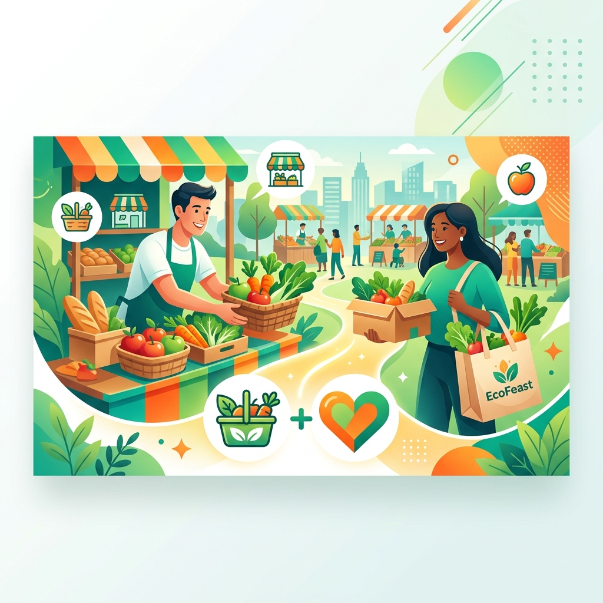

# <p align="center">🌍 EcoFeast</p>

<p align="center">
  <strong>Combating Food Waste through Community Synergy & AI Innovation</strong>
</p>

<p align="center">
  
</p>

<p align="center">
  
  
  
  
</p>

---

## 🌟 The Vision

**EcoFeast** is a mission-driven full-stack ecosystem designed to bridge the gap between surplus food and those who need it most. By connecting food retailers, conscious consumers, charities, and dedicated volunteers, we turn potential waste into community impact.

Our platform leverages **AI-driven insights** to predict expiry, optimize distribution, and gamify sustainability, making every meal rescued a win for the planet.

---

## 🚀 Core Ecosystem Pillars

| Role | Impact | Key Features |
| :--- | :--- | :--- |
| **🏢 Retailers** | *Zero-Waste Efficiency* | Surplus listing, Real-time inventory, Donation credits. |
| **🛒 Consumers** | *Sustainable Savings* | Discounted surplus food, EcoPoints, Order tracking. |
| **❤️ Charities** | *Hunger Relief* | Donation claiming, Volunteer assignment, Task tracking. |
| **🚲 Volunteers** | *Community Action* | Task management, Real-time delivery updates, Status logs. |

---

## 🤖 AI-Powered Intelligence
*Integrated with Google Gemini API*

- **⌛ Smart Expiry Prediction:** Analyze food data to predict optimal consumption windows and marketing tags.
- **📈 Sustainability Analytics:** Real-time calculation of CO2 impact prevented by rescuing food.
- **🍳 Creative Recipe Engine:** Instant recipe suggestions based on rescued ingredients to minimize kitchen waste.
- **🎨 AI Media Generation:** Automated product image generation for retailers to speed up listing creation.

---

## 🛠 Tech Stack

### Frontend
- **Framework:** `React 18` + `Vite`
- **Styling:** `Tailwind CSS` & `Vanilla CSS`
- **Animations:** `Framer Motion`
- **Icons:** `Lucide React`
- **State Management:** `Zustand`
- **Visualization:** `Recharts`

### Backend
- **Server:** `Node.js` + `Express`
- **Real-Time:** `Socket.IO`
- **Database:** `MongoDB Atlas` + `Mongoose`
- **Security:** `JWT` + `BcryptJS`
- **Intelligence:** `@google/genai` (Gemini API)

---

## 🚦 Getting Started

### Prerequisites
- Node.js (v18+)
- MongoDB Atlas Account
- Google AI Studio API Key (Gemini)

### 1. Installation
```bash
# Clone the repository
git clone https://github.com/your-username/ecofeast.git

# Install dependencies
cd ecofeast
npm install
```

### 2. Configuration
Create a `.env` file in the root directory:
```env
PORT=8787
MONGODB_URI=your_mongodb_connection_string
JWT_SECRET=your_jwt_key
GEMINI_API_KEY=your_gemini_api_key
FRONTEND_ORIGIN=http://localhost:5173
```

### 3. Execution
```bash
# Run both Frontend & Backend concurrently
npm run dev:full
```

---

## 📡 API Overview

| Method | Endpoint | Description |
| :--- | :--- | :--- |
| `POST` | `/api/auth/signup` | Register new community members. |
| `GET` | `/api/items` | Browse available surplus items. |
| `POST` | `/api/orders` | Reserve/Claim food items. |
| `PATCH` | `/api/tasks/:id` | Update volunteer delivery status. |
| `POST` | `/api/ai/predict-expiry` | Fetch AI insights for food items. |

---

## 🗺 Roadmap
- [ ] Mobile Application (React Native)
- [ ] Hyper-local push notifications
- [ ] Integration with local food bank APIs
- [ ] Advanced retailer analytics dashboard

---

## 🤝 Contributing
We welcome contributions! Whether it's a bug fix, feature request, or documentation improvement, please feel free to open a Pull Request.

---

## 📄 License
This project is licensed under the **MIT License**. See [LICENSE](LICENSE) for details.

---

<p align="center">
  Made with ❤️ for a Greener Planet
</p>

